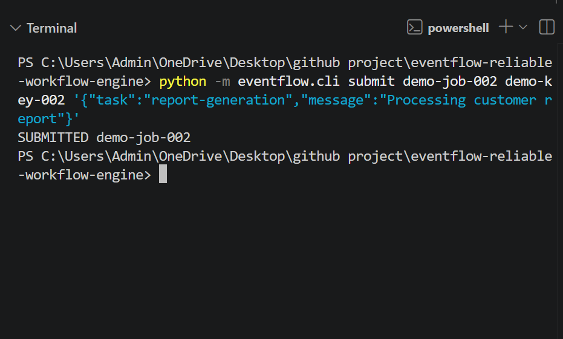
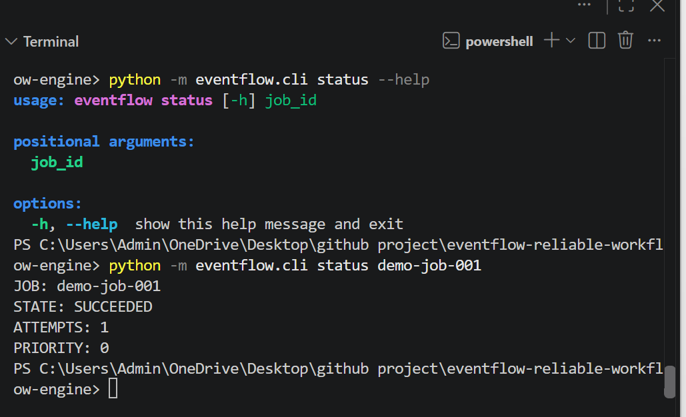
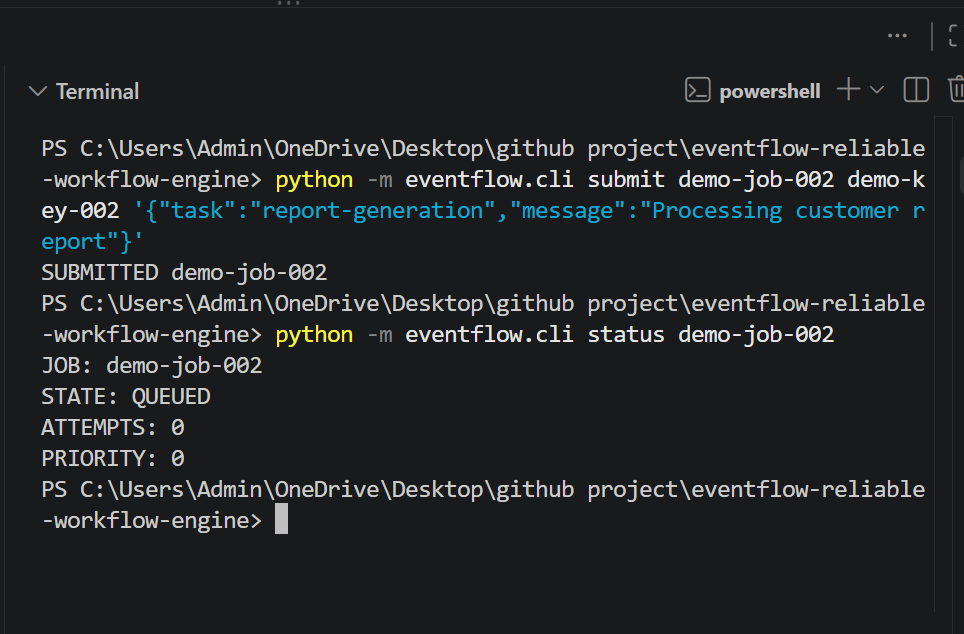
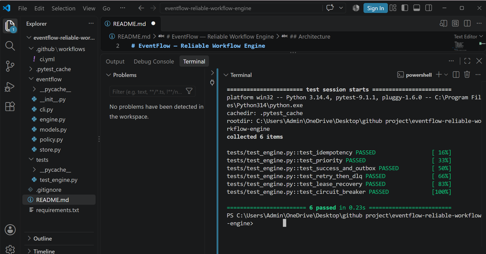

# EventFlow — Reliable Workflow Engine

A Python-based workflow engine for running background jobs reliably.

EventFlow is designed to handle common problems in background job systems such as duplicate jobs, worker failures, retries, stuck jobs, and repeated failures.

Built with **Python and SQLite**, the project focuses on reliability, concurrency, and failure recovery.

**Python · SQLite · Pytest · GitHub Actions**

---

## Overview

Imagine an application that receives background tasks such as:

- Sending an email
- Processing a payment
- Generating a report
- Processing uploaded data

The normal flow is simple:

**Create Job → Worker Picks Job → Execute → Finish**

But real systems can fail.

What if the same job is submitted twice?

What if two workers try to process the same job?

What if a worker crashes?

What if a job fails temporarily?

What if the job keeps failing?

**EventFlow is built to handle these situations.**

It stores job state in SQLite and provides mechanisms for:

- Preventing duplicate jobs
- Priority-based processing
- Safely assigning jobs to workers
- Retrying failed jobs
- Recovering jobs from failed workers
- Handling permanently failing jobs
- Tracking job state

---

## Key Features

| Feature | Purpose |
|---|---|
| **Idempotency** | Prevents the same logical job from being created twice |
| **Priority Scheduling** | Allows important jobs to be processed first |
| **Worker Coordination** | Helps workers safely claim jobs |
| **Retries** | Gives temporary failures another chance |
| **Backoff + Jitter** | Controls repeated retry attempts |
| **Worker Leases** | Recovers jobs when a worker stops unexpectedly |
| **Dead Letter Queue** | Separates jobs that continue failing |
| **Transactional Outbox** | Keeps important workflow events persistent |
| **Circuit Breaker** | Controls repeated failures |
| **SQLite WAL** | Supports concurrent database access |
| **CLI** | Submit, run, and inspect jobs from the terminal |
| **Automated Tests** | Verifies the main reliability behavior |

---

## How It Works

The basic flow is:

~~~mermaid
flowchart TD
    A[Submit Job] --> B[Check Idempotency]

    B --> C{Already Exists?}

    C -->|Yes| D[Return Existing Job]
    C -->|No| E[Save Job in SQLite]

    E --> F[Worker Claims Job]
    F --> G[Run Job]

    G --> H{Success?}

    H -->|Yes| I[SUCCEEDED]
    H -->|No| J[Check Retry]

    J -->|Retry Available| K[Wait and Retry]
    K --> F

    J -->|No Retry| L[DEAD LETTER]
~~~

The idea is simple:

**Save the job → safely run it → recover when something goes wrong.**

---

## System Architecture

~~~mermaid
flowchart TD
    A[Client / CLI] --> B[EventFlow Engine]

    B --> C[Job Manager]
    B --> D[Idempotency]
    B --> E[Priority Scheduler]
    B --> F[Retry Handler]

    C --> G[(SQLite)]
    D --> G
    E --> G
    F --> G

    G --> H[Worker Pool]

    H --> I[Worker 1]
    H --> J[Worker 2]
    H --> K[Worker N]

    I --> L[Execute Job]
    J --> L
    K --> L

    L --> M{Result}

    M -->|Success| N[SUCCEEDED]
    M -->|Failure| O[Retry / Recovery]

    O --> H

    G --> P[Transactional Outbox]
    H --> Q[Lease Recovery]
~~~

### In simple words

1. A client submits a job.
2. EventFlow checks whether the job already exists.
3. The job is stored in SQLite.
4. A worker safely claims the job.
5. The worker executes it.
6. A successful job becomes `SUCCEEDED`.
7. A failed job can be retried.
8. A worker failure can be recovered through its lease.
9. Jobs that continue failing can move to the dead-letter queue.

---

## Job States

EventFlow keeps the job lifecycle explicit.

~~~mermaid
stateDiagram-v2
    [*] --> PENDING

    PENDING --> RUNNING: Worker claims job

    RUNNING --> SUCCEEDED: Job succeeds

    RUNNING --> PENDING: Retry

    RUNNING --> DEAD_LETTER: Retries exhausted

    SUCCEEDED --> [*]
    DEAD_LETTER --> [*]
~~~

### States

**PENDING**  
The job is waiting for a worker.

**RUNNING**  
A worker is currently processing the job.

**SUCCEEDED**  
The job completed successfully.

**DEAD_LETTER**  
The job continued failing and reached the retry limit.

---

## Worker Failure Recovery

One important problem in background systems is a worker disappearing while processing a job.

EventFlow uses a **lease** for this.

~~~mermaid
flowchart TD
    A[Worker Claims Job] --> B[Create Lease]

    B --> C[Worker Runs Job]

    C --> D{Worker Still Running?}

    D -->|Yes| E[Continue]
    D -->|No| F[Lease Expires]

    F --> G[Job Becomes Available]

    G --> H[Another Worker Claims Job]

    H --> C
~~~

This prevents a failed worker from permanently blocking a job.

---

## Retry Handling

Not every failure is permanent.

A temporary failure may succeed when the job is tried again.

~~~mermaid
flowchart TD
    A[Job Fails] --> B{Retries Left?}

    B -->|Yes| C[Calculate Backoff]

    C --> D[Add Jitter]

    D --> E[Try Again]

    E --> F{Success?}

    F -->|Yes| G[SUCCEEDED]
    F -->|No| B

    B -->|No| H[DEAD LETTER]
~~~

This gives temporary failures another chance while preventing endlessly failing jobs from retrying forever.

---

## Why SQLite?

EventFlow uses SQLite to keep the system simple while still providing persistent storage.

Instead of keeping important job information only in Python memory, EventFlow stores it in a database.

This allows the project to explore:

- Persistent job state
- Transactions
- Worker coordination
- Job recovery
- Concurrent access

SQLite WAL mode is used for the project's database access model.

---

## Engineering Decisions

### Idempotency

If the same logical job is submitted again with the same idempotency key, EventFlow can recognize it instead of creating duplicate work.

### Atomic Job Claiming

Workers need to safely claim jobs so that multiple workers do not accidentally process the same job.

### Worker Leases

A job should not remain permanently owned by a worker that has stopped running.

### Retries

Temporary failures should have a chance to recover.

### Backoff and Jitter

Retries should not happen immediately and repeatedly. Backoff controls the delay, while jitter adds variation.

### Dead Letter Queue

Jobs that continue failing eventually leave the normal processing path.

### Transactional Outbox

Important workflow events are stored persistently so they are not lost with process memory.

### Circuit Breaker

Repeated failures can be controlled instead of allowing the same failing operation to continue indefinitely.

---

## CLI Demo

EventFlow can be used directly from the command line.

### Check the CLI

~~~bash
python -m eventflow.cli --help
~~~

### Submit a Job

~~~bash
python -m eventflow.cli submit demo-job-001 demo-key-001 '{"task":"demo","message":"Hello EventFlow"}'
~~~

Output:

~~~text
SUBMITTED demo-job-001
~~~

### Run a Worker

~~~bash
python -m eventflow.cli run --worker demo-worker
~~~

Output:

~~~text
SUCCEEDED
~~~

### Check the Job

~~~bash
python -m eventflow.cli status demo-job-001
~~~

Output:

~~~text
JOB: demo-job-001
STATE: SUCCEEDED
ATTEMPTS: 1
PRIORITY: 0
~~~

---

## Testing

The project includes automated tests for the main reliability features.

Run:

~~~bash
python -m pytest -v
~~~

Current result:

~~~text
6 passed in 0.23s
~~~

The tests cover:

- Idempotency
- Priority scheduling
- Successful execution
- Transactional outbox
- Retry and dead-letter handling
- Worker lease recovery
- Circuit breaker behavior

---

## Project Demo

### Job Submission

### Job Execution

### Job Status

### Test Results

---

## Project Structure

~~~text
eventflow-reliable-workflow-engine/
│
├── eventflow/
│   ├── __init__.py
│   ├── cli.py
│   ├── engine.py
│   ├── models.py
│   ├── policy.py
│   └── store.py
│
├── tests/
│   └── test_engine.py
│
├── screenshots/
│   ├── job-execution.png
│   ├── job-status.png
│   ├── job-submission.png
│   └── test-results.png
│
├── .github/
│   └── workflows/
│       └── ci.yml
│
├── README.md
├── requirements.txt
└── .gitignore
~~~

---

## Technology Stack

- **Python 3.10+** — Workflow engine
- **SQLite** — Persistent job storage
- **SQLite WAL** — Database concurrency
- **Pytest** — Automated testing
- **Git & GitHub** — Version control
- **GitHub Actions** — Continuous integration
- **Docker** — Containerization

---

## What This Project Demonstrates

EventFlow is more than a simple background-job script.

The main goal was to understand what happens when software **fails**, not only when everything works.

The project demonstrates practical concepts such as:

- Python backend development
- Database-backed systems
- Concurrency
- Idempotency
- Retry strategies
- Worker coordination
- Failure recovery
- State machines
- Transactional outbox
- Circuit breakers
- Automated testing
- Continuous integration

---

## Current Limitations

EventFlow is an engineering and learning project rather than a production-scale workflow platform.

Current limitations include:

- SQLite is used instead of a distributed database.
- There is no web dashboard.
- Observability can be expanded.
- Large-scale load testing can be added.
- Distributed worker deployment can be expanded.
- More advanced workflow dependencies can be added.

---

## Future Improvements

Possible next steps include:

- PostgreSQL support
- Distributed workers
- Web dashboard
- Metrics and tracing
- Advanced scheduling
- Workflow dependencies
- Large-scale load testing
- More integration tests
- Operational monitoring

---

## What I Learned

Building EventFlow helped me understand that reliable software is not only about the **successful path**.

The more important questions are:

- What happens if the same request arrives twice?
- What happens if two workers want the same job?
- What happens if a worker stops?
- What happens if a job fails?
- How should retries work?
- When should a job stop retrying?
- How can the system recover its state?

Working through these problems helped me understand **backend systems, concurrency, databases, reliability engineering, and failure recovery** more deeply.

---

## Author

**Sadia Aref**

B.Tech Information Technology Student

Interested in:

- Python
- Backend Development
- Software Engineering
- Distributed Systems
- Reliability Engineering
- Machine Learning
- SQL

---

## Repository

https://github.com/sadiaaref/eventflow-reliable-workflow-engine

---

## License

This project is available under the license included in the repository.