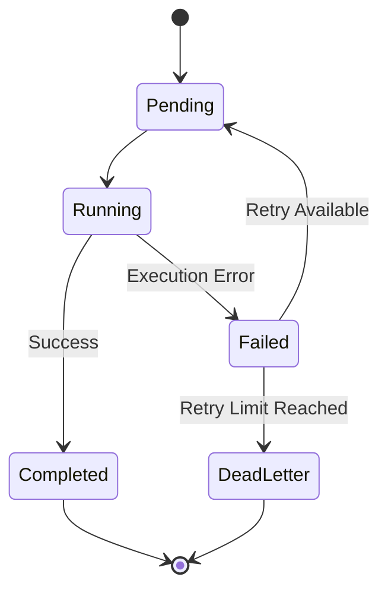

# EventFlow — Reliable Workflow Engine

**A durable asynchronous job execution engine built with Python and SQLite.**

EventFlow is a workflow and job execution engine focused on reliable background processing.

It supports concurrent workers, job scheduling, retries, idempotent execution, failure recovery, priority-based processing, and persistent job state without relying on an external message broker.

The project explores how reliable job execution systems handle concurrency, worker failures, retries, and process restarts.

---

## Why I Built This

A basic background-job system is straightforward until failures and concurrency become part of the problem.

EventFlow focuses on questions such as:

- What happens when a worker crashes while processing a job?
- How do multiple workers avoid claiming the same job?
- How should failed jobs be retried?
- How can retries be handled safely?
- How does job state survive a process restart?
- What happens when a job continues to fail?

The database acts as the persistent source of job state, while workers coordinate execution through that state.

---

## Architecture

```mermaid
flowchart TD
    A[Job Request] --> B[Job Manager]
    B --> C[(SQLite + WAL)]
    C --> D[Atomic Job Claiming]
    D --> E[Concurrent Workers]
    E --> F{Execution Result}
    F -->|Success| G[Completed]
    F -->|Failure| H[Retry + Backoff]
    H --> I{Maximum Retries Reached?}
    I -->|No| J[Schedule Retry]
    J --> C
    I -->Yes|| K[Dead-Letter Queue]
```

### Main Flow

1. A job request is submitted to the job manager.
2. The job is stored in SQLite.
3. A worker atomically claims an available job.
4. The worker executes the job.
5. Successful jobs are marked as completed.
6. Failed jobs are rescheduled using a retry strategy.
7. Jobs exceeding the retry limit are moved to the dead-letter queue.

---

## Reliability Features

### 1. Concurrent Workers

Multiple workers can process jobs concurrently.

Atomic job claiming coordinates ownership and prevents multiple workers from claiming the same job simultaneously.

### 2. Retries with Backoff

Transient failures can be retried instead of immediately becoming permanent failures.

Backoff prevents repeated failures from causing continuous immediate execution.

### 3. Idempotency

Jobs may be executed more than once because of retries or recovery.

EventFlow incorporates idempotency into the execution design so repeated execution can be handled safely.

### 4. Lease-Based Recovery

A worker can fail while processing a job.

Leases allow the system to detect work that is no longer actively being processed and make it available for recovery.

### 5. Dead-Letter Handling

Jobs that continue to fail after the allowed retry attempts are moved to a dead-letter state.

This keeps permanently failing jobs out of the normal processing flow.

### 6. Priority Scheduling

Jobs can be processed according to priority instead of treating every job equally.

### 7. Transactional Outbox

The transactional outbox pattern helps keep database changes and outgoing events consistent.

### 8. Circuit Breaker

The circuit breaker helps prevent repeated calls to an unavailable external dependency.

### 9. SQLite WAL

SQLite Write-Ahead Logging is used to improve concurrent database access while keeping the system lightweight.

---

## Job Lifecycle



Persistent job state allows execution and recovery decisions to survive process restarts.

---

## Project Structure

```text
eventflow-reliable-workflow-engine/
│
├── src/
├── tests/
├── README.md
├── requirements.txt
└── ...
```

The implementation is organized around job management, worker execution, persistence, and reliability handling.

---

## Testing

The project includes tests covering core execution and reliability behaviour.

Areas include:

- Job execution
- Retry behaviour
- Concurrent worker execution
- Idempotency
- Worker failure recovery
- Job state transitions
- Failure handling

Run the test suite with:

```bash
pytest
```

---

## 📸 Screenshots

### 1. Job Submission


### 2. Job Execution


### 3. Job Status


### 4. Test Results


## Tech Stack

| Technology | Purpose |
|---|---|
| Python | Application and execution logic |
| SQLite | Persistent job state |
| SQLite WAL | Concurrent database access |
| Pytest | Testing |
| Docker | Containerized development and runtime |
| GitHub Actions | Continuous integration |

---

## What I Learned

Building EventFlow provided practical experience with the problems that arise when background processing needs to remain reliable under failure and concurrency.

Key areas included:

- Concurrency control
- Database transactions
- Worker coordination
- Retry strategies
- Idempotent execution
- Crash recovery
- State machines
- Failure isolation
- Persistent job state

---

## Future Improvements

Possible areas for further development:

- Metrics and distributed tracing
- More detailed worker observability
- Additional persistence backends
- Horizontal worker scaling
- More advanced scheduling
- Operational tooling for inspecting and replaying failed jobs

---

## Author

**Sadia Aref**

Python Developer | Backend & Software Engineering

[GitHub Profile](https://github.com/sadiaaref)
